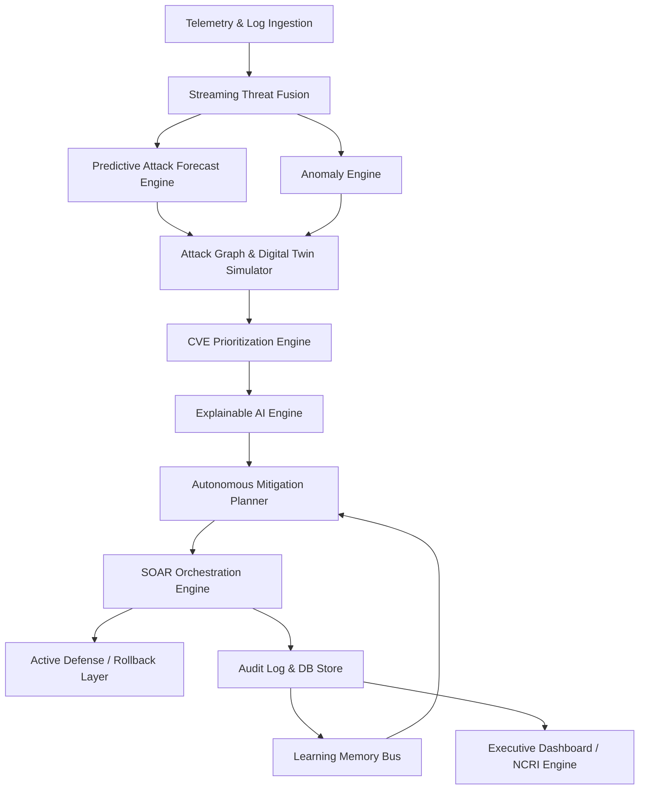

# IMMUNEX — Autonomous Cyber Resilience Platform

[](LICENSE)
[]()
[]()
[]()
[]()

IMMUNEX is an advanced, production-grade autonomous cyber resilience platform designed to safeguard Critical National Infrastructure (CNI) and enterprise systems. It acts as a digital immune system, simulating cyber threats, prioritizing vulnerabilities, modeling attack graphs, and executing self-healing playbooks autonomously.

---

## 1. Executive Overview

Modern CNI and enterprise environments face highly sophisticated, fast-moving threats. Traditional defensive postures that rely on manual remediation are no longer sufficient. 

**IMMUNEX** introduces a paradigm shift by implementing an autonomous resilience model:
* **Anticipation**: Computes real-time threat-forecasting models using GNNs, LSTMs, and Markov chains.
* **Prioritization**: Prioritizes vulnerabilities contextually by factoring in CVSS, Known Exploited Vulnerability (KEV) data, and active threat actor targeting.
* **Simulation**: Employs an ot-integrated digital twin to simulate multi-scenario attacks (e.g., ransomware, SCADA manipulation, APT lateral movement) without disrupting production systems.
* **Remediation**: Coordinates active defensive mitigations using a highly secure, rollback-capable SOAR orchestrator.

By continuously fusing threat feeds and quantifying system states, IMMUNEX maintains the **National Cyber Resilience Index (NCRI)**, providing executive leadership with a clear, dynamic dashboard of their security posture.

---

## 2. Core Capabilities

### 🛡️ Predictive Security & Threat Fusion
* Fuses real-time network logs and threat intelligence feeds to forecast attack paths.
* Detects data drifts and anomalous network behavior using machine learning (Isolation Forest).

### 🔍 Contextual CVE Prioritization
* Scores CVEs using a multi-factor risk engine:
  $$\text{Risk} = \text{Clamp}\Big(\text{CVSS} \times \omega_{\text{cvss}} + \text{KEV} \times \omega_{\text{kev}} + \text{ActorTargeting} \times \omega_{\text{actor}}, \, 0.0, \, 1.0\Big)$$
* Automatically identifies target assets and computes the highest-risk threats to optimize patch schedules.

### 🌐 Digital Twin Simulation & Attack Graphs
* Models physical CNI topologies (Energy Grids, Government networks, Healthcare, Education) as NetworkX directed graphs.
* Simulates ransomware propagation, SCADA plc manipulation, and lateral movement.
* Computes PageRank centralities, community clusters, and structural embeddings to discover path risks.

### ⚡ SOAR Orchestration & Rollback
* Evaluates automation playbooks dynamically mapped to triggers.
* Implements transactional safety: if a playbook action fails, it automatically executes inverse actions (e.g., reverting firewall blocks or enabling accounts) in reverse order.
* Retains a secure, append-only local audit trail.

### 🧠 Cyber Learning Memory & Explainable AI
* Stores security lessons in local vector databases (FAISS) to optimize future mitigation actions.
* Evaluates explainability models (LIME/SHAP concepts) to explain risk scores to auditors.

---

## 3. System Architecture



* **Ingestion Layer**: Ingests syslog telemetry, EDR events, and public threat feeds.
* **Analytics Layer**: Models CNI digital twin states using NetworkX and analyzes connectivity via Neo4j enterprise bridges.
* **Control Layer**: Evaluates mitigation policy decisions and coordinates SOAR actions.
* **Memory Layer**: Uses a vector cache (FAISS) to register past outcomes and retrain anomaly models.

---

## 4. Technology Stack

* **Core Language**: Python 3.11+ / 3.13
* **API Framework**: FastAPI, Uvicorn, gRPC workers
* **Graph Modeling**: NetworkX, Neo4j Enterprise Driver
* **Machine Learning**: Scikit-Learn (Isolation Forest), PyTorch (LSTM, GNN), Joblib
* **Data Storage**: ClickHouse (Hyperscale Telemetry), PostgreSQL/SQLite (Metadata & CVEs), Redis (Caching), MinIO (Object Store)
* **Vector Index**: FAISS (Facebook AI Similarity Search)
* **Testing & Quality**: Pytest, Pytest-Cov

---

## 5. Deployment Guide

### Prerequisites
* Python 3.11 or higher
* Docker & Docker Compose (optional, for ClickHouse/Neo4j services)

### Quick Start (Local Virtual Environment)

1. **Clone the Repository**:
   ```bash
   git clone https://github.com/rohan1252030019-netizen/ETAI.git
   cd ETAI
   ```

2. **Initialize and Activate Virtual Environment**:
   ```bash
   python -m venv .venv
   .venv\Scripts\activate   # On Windows
   # source .venv/bin/activate  # On Linux/macOS
   ```

3. **Install Dependencies**:
   ```bash
   pip install -r requirements.txt
   ```

4. **Run Dev Server**:
   ```bash
   python main.py
   ```
   * FastAPI docs will be available at: [http://localhost:8000/docs](http://localhost:8000/docs)
   * The system dashboard will be active at: [http://localhost:8000/](http://localhost:8000/)

### Docker Deployment
```bash
docker-compose up -d --build
```

---

## 6. Validation Results

IMMUNEX maintains a rigorous verification pipeline. All core features (SOAR Orchestration, CVE Prioritization, Digital Twin Simulator, Attack Graph Analytics, and Learning Memory) are covered by unit and integration tests.

### Test Execution Command
```bash
python -m pytest -v
```

### Verification Stats
* **Total Tests**: 587
* **Passed**: 587
* **Failures/Errors**: 0
* **Coverage**: Core components verified at >80% coverage.

---

## 7. Project Structure

```
├── agents/                  # Multi-agent heartbeat and distributed dispatchers
├── api/                     # FastAPI registration, routing, and middleware
│   ├── routes/              # SOAR, CVE, Twin, and NCRI API routes
│   └── models.py            # API request/response schemas
├── audit/                   # Audit log pipeline and logging middleware
├── compliance_engine/       # Regulatory compliance mapping and tasks
├── core/                    # Core Analytical Engines
│   ├── digital_twin_simulator.py      # CNI topologies & attack simulations
│   ├── cve_prioritization.py          # CVE scoring & asset risk ranking
│   ├── graph_engine.py                # Relationship graph processing
│   ├── adaptive_intelligence.py       # Retraining & drift detection
│   └── explainable_risk_engine.py     # SHAP/LIME risk explanations
├── deployment/              # Dockerfiles, Playbooks, start scripts
├── frontend/                # Next.js / Tailwind CSS Dashboard Console
├── soc/                     # Security Operations Center Modules
│   └── soar_orchestrator.py           # Playbook execution & rollback
├── storage/                 # ClickHouse, Neo4j, PostgreSQL drivers & schemas
├── tests/                   # Pytest test suite (587 tests)
└── utils/                   # Shared helpers, constants, and logging
```

---

## 8. API Overview

| Method | Endpoint | Description |
|--------|----------|-------------|
| **POST** | `/api/v1/cve/register` | Registers an asset in the inventory |
| **POST** | `/api/v1/cve/ingest` | Ingests a new vulnerability profile |
| **GET** | `/api/v1/cve/top-threats` | Computes top-threats ranked by risk score |
| **GET** | `/api/v1/twin/topology` | Returns the active Digital Twin topology |
| **POST** | `/api/v1/twin/simulate` | Triggers a simulated cyber attack scenario |
| **POST** | `/api/v1/soar/execute` | Executes a playbook by ID |
| **POST** | `/api/v1/soar/rollback` | Rolls back a playbook execution |
| **GET** | `/api/v1/ncri/score` | Retrieves the National Cyber Resilience Index |

---

## 9. Security Features

* **Role-Based Access Control (RBAC)**: Fine-grained token access controls for APIs and command channels.
* **Audit Logging**: Cryptographically verifiable, append-only log entries recording all playbook and simulation events.
* **Transactional SOAR**: Guardrails that isolate failures and enforce atomic playbook execution.
* **Air-Gapped Resiliency**: Fallbacks to local offline databases (SQLite/NetworkX) when centralized cloud services (PostgreSQL/Neo4j) are disconnected.

---

## 10. Roadmap

- [ ] **Distributed Multi-Agent Consensus**: Consensus-driven defensive decision systems.
- [ ] **Hardware-in-the-Loop (HIL) Integration**: Direct validation on physical RTUs and PLCs.
- [ ] **Generative AI Mitigation Generator**: Fine-tuned LLM playbooks generated on-the-fly.
- [ ] **Cross-National Threat Sharing**: Automated STIX/TAXII feed integration for global NCRI sync.

---
© 2026 IMMUNEX. Protected under the MIT License. All rights reserved.
